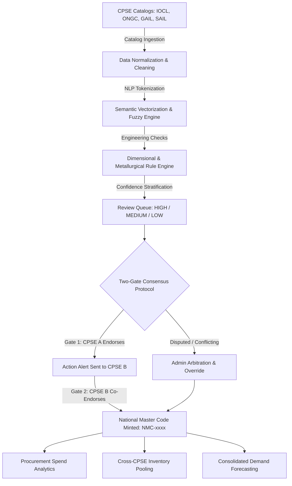

# 🏛️ NMC Platform — National Material Code
### AI-Driven Standardization and Harmonization of Material Codes Across CPSEs

<!-- Core Badges & Tech Stack Matrix -->
<div align="left">

[](https://www.python.org/)
[](https://fastapi.tiangolo.com/)
[](https://react.dev/)
[](https://www.typescriptlang.org/)
[](https://vitejs.dev/)
[](https://tailwindcss.com/)
[](https://www.radix-ui.com/)
[](https://tanstack.com/query)

[](https://www.postgresql.org/)
[](https://supabase.com/)
[](https://www.sqlalchemy.org/)
[](https://scikit-learn.org/)
[](https://pandas.pydata.org/)
[](https://numpy.org/)
[](https://huggingface.co/)

[](https://www.docker.com/)
[](https://render.com/)
[](https://sih.gov.in/)
[](https://opensource.org/licenses/MIT)

</div>

---

## 📌 Problem Statement (SIH26099)
India's premier Central Public Sector Enterprises (CPSEs)—such as **ONGC, IOCL, GAIL, SAIL, BHEL, and NTPC**—procure billions of rupees worth of industrial materials annually across isolated ERP ecosystems (SAP ECC/S4, Oracle EBS, IBM Maximo). 

Because each enterprise uses custom, non-standardized item naming conventions, **the exact same physical engineering component is cataloged under completely different codes and descriptions**:

| CPSE | Legacy Material Code | Recorded ERP Description |
| :--- | :--- | :--- |
| **IOCL (Refinery)** | `IOCL-M-48910` | `HEX BOLT SS316 M12X50MM FULL THREAD DIN 933` |
| **ONGC (Offshore)** | `ONGC-MECH-1029` | `SS-316 HEXAGONAL BOLTS 12MM DIA 50MM LENGTH` |
| **GAIL (Pipeline)** | `GAIL-FAST-0034` | `BOLT, HEX HD, 1.2CM X 5.0CM, GRADE 316 STAINLESS` |

### 💥 Industrial Pain Points
* **Fragmented Procurement:** CPSEs independently procure identical materials without joint bargaining leverage.
* **Significant Price Variance:** One CPSE frequently pays 30%–45% more than another for identical engineering items.
* **Capital Lockup in Inventory:** Millions of rupees are tied up in buffer inventory while neighboring CPSE units hold idle surplus stock of identical items.
* **No National Master Standard:** Lack of an overarching cross-enterprise classification standard for public sector procurement.

---

## 💡 The Solution: National Material Code (NMC) Platform
The **NMC Platform** acts as an enterprise harmonization layer. It combines an **AI/NLP Matching Engine** with a **Two-Gate Peer-to-Peer Consensus Protocol** to unify legacy material codes into an authoritative **Common Material Master (CMM)**—without corrupting or modifying underlying CPSE ERP databases.

---

## ⚖️ Legacy Approach vs. NMC Platform

| Capability | Legacy CPSE Ecosystem | NMC Platform Solution |
| :--- | :--- | :--- |
| **Catalog Visibility** | Siloed within individual CPSE ERPs | Unified National Cross-Enterprise Portal |
| **Material Matching** | Manual, error-prone keyword lookups | Hybrid AI: Dense Embeddings + NLP + Engineering Rules |
| **Governance & Approval** | Unilateral, fragmented decisions | Two-Gate Peer Consensus Protocol (Gate 1 + Gate 2) |
| **Code Standard** | Proprietary internal item codes | Unified Deterministic Standard: `NMC-[FAMILY]-[HASH]-[SEQ]` |
| **Procurement Intelligence**| Zero cross-CPSE price visibility | Real-time Price Variance & Bulk Joint Tender Aggregation |
| **Inventory Optimization** | Isolated safety stock per warehouse | Cross-CPSE Inventory Surplus Sharing & Pooling |

---

## 🏗️ System Architecture & End-to-End Workflow



---

## 🚀 Key Technical Innovations

### 1. 🧠 Hybrid Multi-Tier AI Matching Engine
- **Dense Semantic Embeddings:** Uses `sentence-transformers/all-MiniLM-L6-v2` generating 384-dimensional vector representations of material descriptions.
- **Syntactic Token & Fuzzy Analysis:** Utilizes **RapidFuzz** token set ratios and **TF-IDF n-gram** matrices to catch word-order permutations and abbreviations.
- **Dimensional & Metallurgical Guardrails:** An engineering rule engine checks extracted physical properties (e.g., thread pitch, diameter, pressure rating, grade SS304 vs SS316). A 12mm bolt will **never** match a 16mm bolt, eliminating catastrophic false positives.

### 2. 🛡️ The Two-Gate Peer-to-Peer Consensus Protocol
*In safety-critical industrial operations (oil refineries, power stations, steel plants), no single enterprise can unilaterally alter material standards:*
- **Gate 1 (First Endorsement):** A certified reviewer from CPSE A inspects and endorses a candidate pair (`GATE_1_APPROVED`).
- **Real-Time Action Alerts:** The match immediately surfaces in CPSE B's **Action Alerts** tab with a high-priority pulse notification.
- **Gate 2 (Co-Endorsement):** When CPSE B's reviewer confirms the match, **Consensus is achieved**, and the National Master Code is minted.

> [!IMPORTANT]
> **Zero Unilateral Risk:** A National Master Code is NEVER created by a single party. Both the source and candidate CPSE engineering reviewers must independently verify the match, eliminating industrial liability.

---

## 📋 Comprehensive 7-Tab Review Queue Matrix

The Review Queue is partitioned into 7 dedicated operational views tailored for CPSE domain reviewers and Central Administrators:

| Tab | Target Audience | Primary Function | Trigger / Workflow Condition |
| :--- | :---: | :--- | :--- |
| **1. Pending** | Reviewers | Primary evaluation queue | AI-generated candidate pairs awaiting technical evaluation |
| **2. Action Alerts** | Reviewers | Immediate action requests | Counterpart CPSE endorsed a match (`Gate 1`) OR high-confidence ($\ge 85\%$) NMC match |
| **3. Awaiting Peer** | Reviewers | Outbound tracking | Matches endorsed by your CPSE, currently waiting for peer co-endorsement (`Gate 2`) |
| **4. Already Mapped** | All | National Master Directory | Materials officially linked to a finalized National Material Code (`NMC-xxxx`) |
| **5. Different** | Reviewers | Distinct classification | Items confirmed by engineers as physically or technically non-interchangeable |
| **6. Rejected** | Reviewers | False-positive quarantine | Matches flagged as incorrect or non-viable candidate pairs |
| **7. Conflicts** | **Admin Only** | Central arbitration | Disputed decisions where CPSEs disagree; resolved via Administrative Override |

---

### 3. 🏷️ Deterministic National Material Code Standard
Generated National Master Codes follow a deterministic, collision-free standard:
$$\mathbf{NMC - [FAMILY6] - [HASH6] - [SEQ03d]}$$
*Example:* `NMC-FASTEN-0F28F9-001` or `NMC-VALVE-7B41A2-002`
- Synthesizes a clean, standardized **Canonical Description** (e.g., `HEXAGONAL HEAD BOLT, STAINLESS STEEL 316, M12 X 50MM, FULL THREAD, DIN 933`).
- Preserves bi-directional mappings to all historical CPSE legacy codes in the `material_mappings` index.

---

## 💰 Procurement Intelligence & Measurable Economic Impact

The NMC Platform translates catalog standardization directly into public procurement cost savings across 4 specialized modules:

### 1. Cross-CPSE Price Variance Discovery
When different CPSEs purchase the exact same physical item under disparate names, massive pricing inefficiencies occur:

| Material (Unified NMC Code) | CPSE A Purchase Price | CPSE B Purchase Price | Price Variance | Benchmark Saving Opportunity |
| :--- | :---: | :---: | :---: | :---: |
| **`NMC-VALVE-7B41A2-001`** (2" Ball Valve Class 150) | ₹14,200 / unit *(IOCL)* | ₹9,800 / unit *(ONGC)* | **+44.9%** | ₹4,400 / unit savings for IOCL |
| **`NMC-FASTEN-0F28F9-001`** (M12 SS316 Hex Bolt) | ₹185 / unit *(GAIL)* | ₹132 / unit *(BHEL)* | **+40.1%** | ₹53 / unit savings for GAIL |
| **`NMC-GASKET-3A19C4-003`** (Spiral Wound Gasket 4")| ₹890 / unit *(SAIL)* | ₹640 / unit *(NTPC)* | **+39.0%** | ₹250 / unit savings for SAIL |

### 2. Bulk Joint Tender Aggregation
- Aggregates multi-CPSE annual demand forecasts for identical National Master Codes.
- Allows the Ministry / Central Procurement Framework to float **joint consolidated tenders**, yielding **15% – 25% bulk discounts**.

### 3. Cross-Enterprise Inventory Surplus Pooling
- **Surplus Sharing:** When CPSE A is preparing to issue an external procurement tender for an item, the platform checks whether CPSE B holds excess available inventory (`available_quantity > 0`).
- Enables inter-CPSE stock transfers, reducing external cash outflow and liquidating dormant inventory.

---

## 📊 Key Performance Indicators (KPIs)

```
┌─────────────────────────┬─────────────────────────┬─────────────────────────┐
│     94.2% AI Accuracy   │     31.4% Deduplication │     <24h Consensus Time │
│  Rule-guarded precision │   Cross-CPSE catalog overlap│  Two-Gate review velocity│
└─────────────────────────┴─────────────────────────┴─────────────────────────┘
┌─────────────────────────┬─────────────────────────┬─────────────────────────┐
│   18.5% Avg Cost Savings│    ₹ Crores Inventory   │    100% Audit Complete  │
│  Via joint bulk tenders │   Capital unlocked      │   Zero raw data deletion│
└─────────────────────────┴─────────────────────────┴─────────────────────────┘
```

---

## 🔌 Core API Architecture Matrix

The FastAPI backend exposes modular, high-throughput RESTful endpoints:

| Endpoint | Method | Role | Description |
| :--- | :---: | :---: | :--- |
| `/api/nmc/auth/login` | `POST` | Public | Authenticates Admin or Certified CPSE Reviewer |
| `/api/nmc/review/queue` | `GET` | Reviewer / Admin | Paginated review queue with confidence & CPSE filters |
| `/api/nmc/review/stats` | `GET` | Reviewer / Admin | Real-time counts across all 7 review queue tabs |
| `/api/nmc/review/{id}/decision` | `POST` | Reviewer / Admin | Submits Gate 1/Gate 2 verdicts or Administrative Overrides |
| `/api/nmc/review/notifications`| `GET` | Reviewer | Real-time action alerts for peer endorsements & NMC matches |
| `/api/nmc/procurement/price-variance` | `GET` | All | Price discrepancy analytics across CPSE purchases |
| `/api/nmc/procurement/inventory` | `GET` | All | Cross-CPSE stock availability and surplus pooling |
| `/api/nmc/procurement/demand` | `GET` | All | Consolidated demand forecasting & tender opportunities |
| `/api/nmc/analytics/metrics` | `GET` | Admin | Macro harmonization rate, deduplication matrix & velocity |

---

## 🛠️ Technology Stack

| Layer | Technologies | Purpose |
| :--- | :--- | :--- |
| **Frontend** | React 18, TypeScript, Vite, Tailwind CSS | High-performance, responsive UI with accessible Shadcn / Radix components |
| **Client State** | TanStack React Query (v5) | Server-state caching, optimistic updates, and background synchronization |
| **Backend API** | FastAPI, Python 3.11, Uvicorn | Asynchronous high-throughput REST API with automated OpenAPI / Swagger docs |
| **Validation** | Pydantic v2, Pydantic-Settings | Strict schema validation and type-safe environment configuration |
| **AI / NLP Engine**| Scikit-learn, RapidFuzz, Pandas, NumPy | Multi-stage fuzzy matching, token standardization, and domain heuristics |
| **Semantic AI** | Sentence Transformers (`all-MiniLM-L6-v2`) | Dense semantic embeddings for contextual similarity |
| **Database & ORM**| PostgreSQL (Supabase), SQLAlchemy 2.0 | ACID-compliant relational persistence, indexed foreign keys, connection pooling |
| **Hosting & Cloud**| Render, Docker, UptimeRobot | Cloud deployment, containerization, and synthetic health monitoring |

---

## 📁 Repository Structure

```
├── client/                     # React + TypeScript + Vite frontend
│   ├── src/
│   │   ├── components/         # Reusable UI, dialogs, & analytics charts
│   │   ├── pages/              # Review Queue, Analytics, Procurement, Manage CPSEs
│   │   ├── services/           # Typed Axios API service client
│   │   └── hooks/              # Custom authentication & state hooks
│   └── package.json
│
├── server/                     # FastAPI Python backend
│   ├── app/
│   │   ├── api/                # REST API routers (review, procurement, auth, analytics)
│   │   ├── db/                 # Consolidated SQLAlchemy database repository
│   │   ├── models/             # Relational PostgreSQL ORM models
│   │   └── config.py           # Pydantic environment configuration
│   ├── services/               # AI matching, rule validation, & confidence services
│   ├── pipeline/               # Material standardization & normalization pipeline
│   └── requirements.txt
│
├── config/                     # Domain rule and validation threshold configs
├── data/                       # Reference CPSE master datasets
└── docker-compose.yml          # Containerized local orchestration
```

---

## ⚡ Quick Start & Local Setup

### Prerequisites
* **Node.js** (v18+) & **npm**
* **Python** (v3.10+)

### 1. Clone the Repository
```bash
git clone https://github.com/<your-username>/<your-repo-name>.git
cd <your-repo-name>
```

### 2. Backend Setup
```bash
cd server
python -m venv venv
# On Windows:
.\venv\Scripts\activate
# On Linux/macOS:
source venv/bin/activate

pip install -r requirements.txt
uvicorn app.main:app --reload --port 8000
```
*API Swagger Documentation will be live at:* `http://localhost:8000/docs`

### 3. Frontend Setup
```bash
cd ../client
npm install
npm run dev
```
*Frontend Application will be live at:* `http://localhost:5173`

---

## 🔒 Security & Data Governance
* **Role-Based Access Control (RBAC):** Strict boundaries separating Admin oversight from CPSE-specific Reviewers.
* **Immutable Audit Trail:** Every single decision, endorsement, rejection, and override is permanently recorded with timestamps, actor credentials, and state deltas.
* **Data Privacy:** Raw CPSE internal databases remain untouched; the platform acts as an intelligent, read-safe standardization overlay.

---

## 👥 Team & Acknowledgments
* **Competition:** Smart India Hackathon (SIH)
* **Problem Statement ID:** SIH26099
* **Domain:** AI / ML, Enterprise Procurement & Supply Chain Optimization

